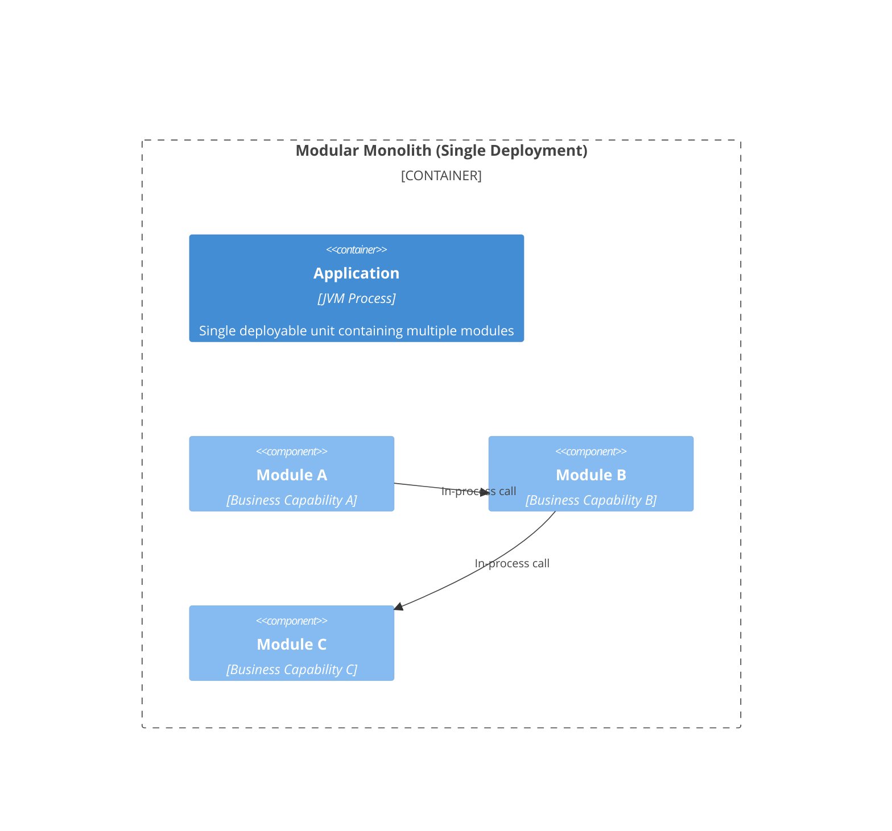
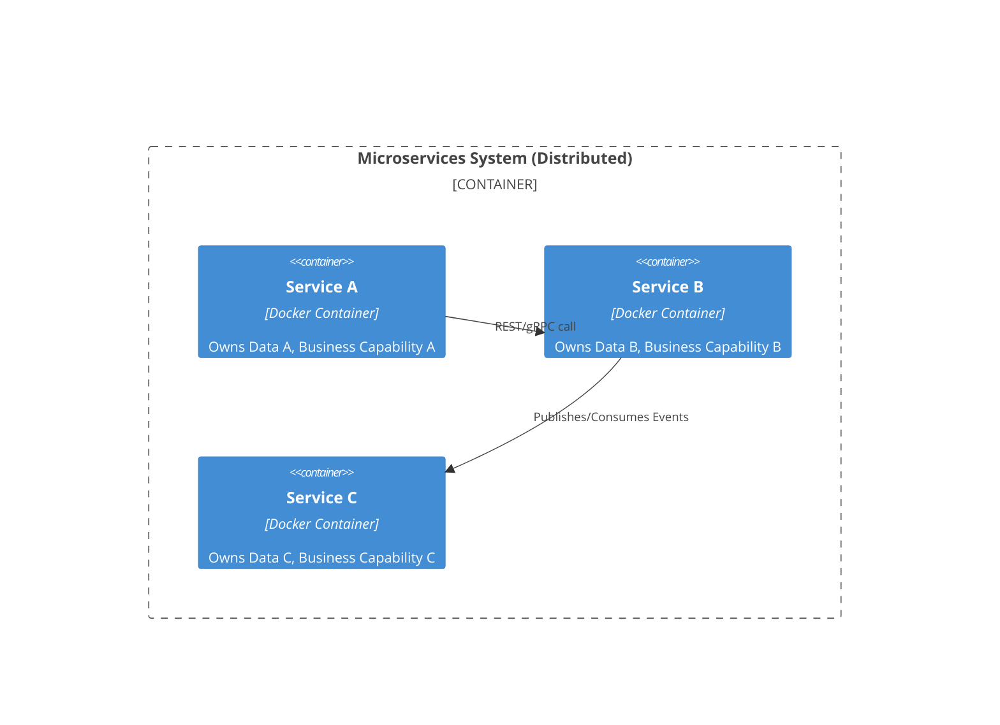

Why would you build a (modular) monolith instead of a microservice? Often people jump on a hype train or go for "résumé driven development”, because everyone needs to have a microservices in their CV, right?

To make a good choice between a modular monolith and a microservice we need to understand the problem they solve. And the problem is not primarily a technical one. To better understand from where Microservices come from let’s take a look at the history of microservices.

## When did the Term "Microservices" actually appear?

“Microservice” first surfaced in 2011 to describe the fine-grained, business-focused several pioneers were already building. Defined formally in 2014, the idea has matured from a lightweight reaction to heavyweight service-oriented architecture into today’s cloud-native backbone that pairs independent deployment with DevOps, containers, service meshes and — inevitably — new governance headaches.

## What did “Microservice” mean at first?

Early talks and the 2014 Fowler–Lewis article framed a microservice as:

> “In short, the microservice architectural style 1 is an approach to developing a single application as a suite of small services, each running in its own process and communicating with lightweight mechanisms, often an HTTP resource API. These services are built around business capabilities and independently deployable by fully automated deployment machinery. There is a bare minimum of centralized management of these services, which may be written in different programming languages and use different data storage technologies.”

Key notions in 2011 to 2014:

* **Fine-grained SOA:** Adrian Cockcroft called Netflix’s approach “fine-grained SOA” before the new name stuck.
* **Unix philosophy:** Rodgers and Lewis stressed “smart endpoints, dumb pipes” and doing one thing well.
* **REST over SOAP:** Rejecting Enterprise Service Bus in favour of simple HTTP JSON APIs.
* **Team size heuristic:** Services should fit in a “two-pizza team”.

## How has the concept evolved?

* From size to responsibility: Initial debates about “how many lines of code” shifted to bounded context and business outcome. Microservices today are defined by clear domain ownership rather than physical size.
* Cloud-native tooling: Containers, orchestration, CI/CD and infrastructure-as-code turned independent deployment from aspiration to default practice.
* Resilience patterns: Circuit breakers (Hystrix), service discovery (Eureka) and chaos testing (Chaos Monkey) emerged at Netflix and were widely copied.
* Decentralized data: “One DB per service” replaced shared enterprise schemas, trading transactional ease for autonomy
* Operational mesh: Service meshes (Istio, Linkerd) now handle cross-cutting concerns such as observability and zero-trust security—problems scarcely mentioned in 2014
* Serverless & micro-frontends: Functions-as-a-Service and decomposed UIs apply the same principles at smaller granularity
* Push-back & alternatives: Voices like Martin Fowler (“Monolith First”) warn against premature fragmentation; “modular monoliths” and “macro-services” offer middle roads

## Definition today

A modern microservice is best described as an independently deployable, loosely coupled component that owns its data and encapsulates a single business capability, built and run by a small cross-functional team, and integrated through lightweight, observable APIs. Size is secondary; operability, bounded context and continuous delivery are essential.

## Microservices scale the Organization

Microservices are thought to be a means to manage large scale organizational systems in which multiple teams, often in different locations, with different tech stacks need to work on one integrated system. The reason for that is mostly, that at some scale, the development of the system would not scale anymore. The number of teams and their dependencies can become hard or even impossible to manage efficiently. **The problem it solves is an organizational and not a technical one.

Microservices are thought to scale the organization and development, the value stream. A value stream is just the flow of work from idea to customer — how value moves through your organization. It focuses on the flow of work, from the initial idea through development, testing, deployment, and customer delivery. If you don’t have the problem of an “unmanageable” number of teams, you are probably looking for microservices from a wrong point of view.

Microservices began as a name for an existing grassroots practice — building independently deployable slices of functionality — and quickly cemented itself through cloud tooling and success stories at Netflix, Amazon and beyond. Over a decade later, the style remains a powerful but demanding choice: it excels when teams own clear domains and can invest in platform automation; it backfires when adopted prematurely or at the wrong scale. As serverless and service-mesh technologies blur the boundaries again, the core lesson endures: Architecture must follow business boundaries, not hype cycles.

Microservices come also with overhead: You’ll have to take care of observability, fail-over, and deal with the downsides of a distributed system that is using the network to communicate. There are solutions like the sidecar pattern but all of it adds additional complexity.

### Other Reasons to Consider Microservices

Although scaling the organization is the primary reason to adopt microservices, there are several secondary motivations that can make them a good fit in *specific* situations. Microservices allow **independent scaling** of individual capabilities, so you can allocate more resources to the parts of the system that experience higher load without replicating the entire application. They also support **polyglot flexibility**, letting teams use the most suitable language, framework, or database for their domain rather than conforming to a single technology stack.

From an operational standpoint, microservices can improve **resilience** by isolating failures. When a single service fails, it doesn’t necessarily bring down the whole system. Combined with **mature** CI/CD automation, this isolation enables smaller, faster, and lower-risk deployments, where each team can release its service independently.

Microservices also strengthen **security boundaries**, allowing sensitive parts of the system to be deployed and managed under stricter network or compliance constraints. They promote autonomous teams with **clear ownership** — each team can take full responsibility for its service, from development to production. In some cases, the well-defined APIs of microservices even encourage reuse across internal or external consumers.

Finally, microservices align naturally with **cloud-native architectures** — containers, service meshes, and serverless functions all thrive on independently deployable components. For SaaS platforms, they can also simplify tenant isolation, enabling independent scaling or updates per tenant.

**While these are strong arguments, they only yield value when a team can handle the operational and architectural complexity that comes with distributed systems. Without that maturity, the costs can easily outweigh the benefits.**

### Comparison Table

| **Aspect**                | **Modular Monolith**                                                                 | **Microservices**                                                                    |
|---------------------------|-------------------------------------------------------------------------------------|-------------------------------------------------------------------------------------|
| **Definition**            | A single application with logically separated modules, each handling a bounded context, deployed as one unit. | A suite of small, independent services, each handling a specific business capability, deployed separately. |
| **Deployment**            | Single deployment unit. All modules share the same process and runtime. Can scale vertically or by running multiple instances. | Multiple independent deployment units. Each service has its own process and can be scaled independently. |
| **Communication**         | Internal calls between modules (e.g., function calls or message queues within the same process). Fast and simple. | Inter-service communication via lightweight APIs (e.g., HTTP/REST, gRPC) over the network. Adds latency and complexity. |
| **Data Management**       | Shared database or schema, though modules can have logical separation. Easier transactions but risks coupling. | Each service owns its database, enforcing decentralized data. Avoids coupling but complicates distributed transactions. |
| **Scalability**           | Scales vertically (more powerful hardware) or by deploying multiple instances. Limited by single-unit constraints. | Scales horizontally (more instances of specific services). Ideal for targeted scaling but requires orchestration (e.g., Kubernetes). |
| **Organizational Fit**    | Suited for small to medium teams with cohesive workflows. Simplifies collaboration and reduces overhead. | Ideal for large organizations with multiple teams, enabling independent development and polyglot tech stacks. |
| **Complexity**            | Lower operational complexity. Easier to debug, test, and monitor within a single process. | Higher complexity due to distributed systems. Requires observability (e.g., Prometheus), service discovery, and resilience patterns (e.g., circuit breakers). |
| **Development Speed**     | Faster initial development and iteration due to unified codebase and simpler deployment. | Slower initial setup due to infrastructure needs (e.g., CI/CD pipelines, service meshes) but enables parallel team work. |
| **Maintainability**       | Easier to maintain if well-structured (clear module boundaries). Risks becoming a "big ball of mud" without discipline. | Maintainable with clear domain boundaries but risks creating a "distributed big ball of mud" if services are poorly sliced. |
| **Technology Flexibility** | Limited to a single tech stack for all modules, though modules can use different libraries or frameworks. | Supports polyglot environments (different languages, frameworks, or databases per service). |
| **Operational Overhead**  | Lower overhead. Single deployment, monitoring, and logging setup. | Higher overhead. Requires service orchestration, network management, and distributed logging/monitoring. |
| **Security**              | Fewer external endpoints, reducing attack surfaces. Single-point-of-failure risk. | More API endpoints increase security concerns (e.g., zero-trust via service meshes). Better isolation but needs robust API security. |
| **Cost Efficiency**       | Lower infrastructure costs (single runtime, shared resources). Suited for smaller-scale projects. | Higher costs due to multiple runtimes, databases, and orchestration tools. Justified for large-scale systems. |
| **Use Case Fit**          | Best for startups, small teams, or projects where organizational scalability isn’t a bottleneck. | Best for large enterprises with many teams, complex domains, or need for independent scaling/deployment. |
| **Risks**                 | Risk of tight coupling if modules aren’t well-separated. Harder to scale organizationally with many teams. | Risk of distributed system failures (e.g., network latency, partial outages). Complex debugging and governance. |
| **Future-Proofing**       | Flexible for gradual evolution to microservices if needed. Less tied to specific cloud-native tools. | More future-proof for large-scale, distributed systems but can lock into specific tech (e.g., API protocols). |

## Boundaries are critical — for both

Achieving a modular monolith requires enforcing clear boundaries between internal domains—the architectural equivalent of the "bounded context". This is primarily done through a **strict** layering known as explicit module dependencies and internal APIs. Each module (or business capability) must expose only a small, well-defined public interface (its internal API) to other modules, typically consisting of dedicated classes for commands, queries, and events. Direct access to the internal classes, private methods, or data stores of a peer module must be **strictly forbidden**.

Enforcing this separation through compiler checks or architectural constraint tools (like ArchUnit in Java or custom linters) prevents the code from devolving into a tightly coupled "big ball of mud," ensuring that each module can be developed and potentially extracted independently later on.

Though the same is true for Microservices, just that your boundaries become your network calls, your deployment units. It is easier to enforce the boundaries, because now they are physical boundaries, for different teams but you will still suffer terrible from badly sliced boundaries if you don't get them right.

## Conclusion

If you don’t have that problem of organizational scalability, a modular monolith might be a very good choice for your system architecture. If organizational scale is not your bottleneck, a well-structured modular monolith can offer many of the same benefits as microservices, with far less complexity.

A modular monolith can scale very well and you can also deploy many instances of it, some maybe utilizing just a few modules in one instance to do something very specific or to scale the capability provided by those modules vertically.

The only thing you won’t get is scaling the organization and using multiple different tech stacks. But this is actually **not** the problem most organizations have that jump on microservices.

If you can’t slice your microservices properly, they won’t scale well either and in the worst case, you get the worst thing you can ever have: A distributed big ball of mud.

> “If you can’t build a well-structured monolith, what makes you think microservices is the answer?” — Simon Brown, in a keynote at DevNexus, March 2016.

My recommendation would be to always go for a modular monolith first unless you are that big organization that has many teams with many different tech stacks that need to improve their collaboration and you have somebody with strong architectural skills to slice the system correctly, because if your microservices are not sliced correctly, you signed up for building the worst thing you probably can have. Architecture should follow your business, not your tooling. If you can’t keep a monolith clean, microservices won’t save you — they’ll only distribute the mess.
