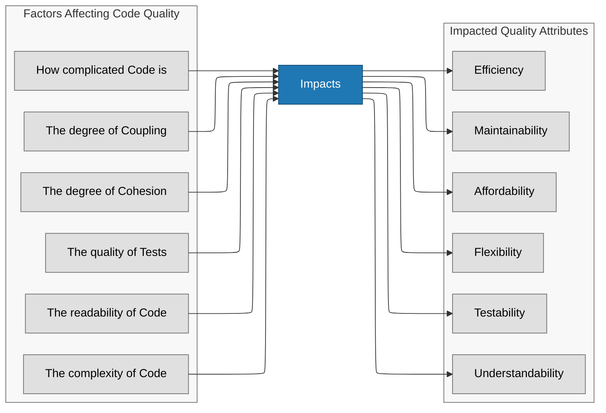
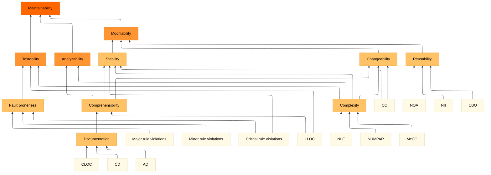
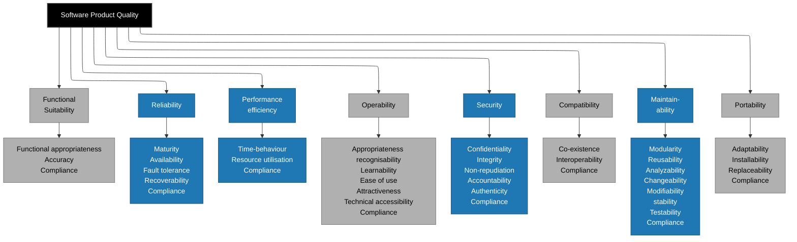

If done right. -- To get there as a company, especially the management, and developers alike, need to understand what software quality in software means and how to achieve it. Let us start by talking about the broader scope of quality in software projects.

## What is Quality in Software?

Almost all developers respond to this question with "A high code coverage", which is probably the most obvious one to think about, but there is a lot more than this. When I then start to elaborate about quality and ask "What about the quality of the tests? How do you know that you have good tests?" there is usually also silence.

While code metrics (like coupling, cohesion, and complexity) are great for looking under the hood, they only tell part of the story. A piece of software can have clean and beautiful code but still be an absolute nightmare for the business or the end user. A project manager or owner will probably see quality from a very different perspective like the number of defects being reported or by customer happiness surveys. Different stakeholders at different levels in an organization will have a different perspective on what they define as quality from their point of view.

To get a full picture of software quality, we also need to look at external quality factors, how the software behaves in the wild, and process quality factors, how efficiently the team can deliver it. Quality must be present in **all** stages and areas of the organization and the software development life-cycle. Below are different categories of quality with some things you can and should measure.

I like to categorize quality into five categories, based on the stakeholders in different areas of the value chain.

| Category | Focused On | Key Examples | Typical Metrics / Indicators | Stakeholders (Impacted / Concerned) |
| --- | --- | --- | --- | --- |
| Internal (Code) | Maintainability & Structure | Low Coupling, High Cohesion, Readability, Complexity | Coupling/Cohesion scores, Cyclomatic complexity, Technical Debt ratio, Code duplication %, SonarQube maintainability rating | Developers, Architects, Tech Leads, Engineering Managers |
| Operational | Behavior & Stability | Low Latency, High Uptime, Reliability | MTBF / MTTR, Change Failure Rate, Defect density, Performance efficiency (throughput, resource usage), Scalability under load | SRE/Ops, DevOps, Support Teams, End Users |
| Experience | Human Interaction | High Usability, Accessibility, User Satisfaction | Task completion time, Error rates in user journeys, NPS/CSAT, Accessibility compliance (WCAG), Learnability | End Users, UX Designers, Product Owners, Customer Success |
| Process | Speed & Safety | Low Lead Time, Low Change Failure Rate | Deployment Frequency, Lead Time for Changes, Time to Restore Service (DORA metrics), Build success rate, Test execution time | Engineering Managers, DevOps/SRE, Scrum Masters, Upper Management |
| Business & Security | Risk Protection & Business Value | Security & Vulnerability, Functional Suitability (Correctness) | Vulnerability count/CVE severity, Security scan pass rate, Penetration test findings, Requirement coverage %, Production defect rate (functional), OWASP compliance | Executive Management, Security/Compliance, Product Owners, Legal, Business Stakeholders |

Now let's go through each of them in a little more detail. Skip the section if you're not interested in the details of each category.

### Internal Quality: How it is built

These metrics assess structural integrity, technical debt, and how easily a new engineer can step in and modify the system without breaking things.

* Maintainability & Modifiability: How much effort does it take to fix a bug, add a new feature, or refactor a component?
* Testability: How easy is it to isolate pieces of code and verify they work correctly?
* Adherence to Standards (Linting & Style): Does the codebase look like it was written by a single person, or is it a chaotic mix of different coding styles?
* Technical Debt & Code Smells: How many "shortcuts" have been taken that will slow down future development?
* Portability & Reusability: Can sections of this code be easily dropped into another project, or moved to a different operating system/cloud provider if needed?
* Architecture Compliance: Does the actual codebase respect the intended high-level architectural boundaries (e.g., ensuring the UI layer doesn't bypass the application layer to talk directly to the database)?

Given the wide spread impact the quality of your code has it is sad to see that it is often neglected and considered to unecessary "to make the code beautiful". This is not about beauty, it is about saving time and cost and the developers more happy. Nobody likes to wade through an unmaintainable, dirty code base.

### Operational Quality: How it runs

These metrics measure how the software behaves while running in a production environment.

* Performance & Efficiency: How fast does the system respond, and how well does it use resources?
* Availability & Reliability: Is the system up when users need it, and does it do its job without crashing?
* Scalability: Can the system handle a sudden spike in users or data volume without breaking a sweat?

### User Experience Quality: How it feels

A system can be bug-free but still fail if users hate interacting with it.

* Usability: How intuitive is the software for the target audience?
* Accessibility (a11y): Can people with disabilities (visual, auditory, motor, or cognitive impairments) use the software?

### Business & Security Quality: How safe and valuable it is

These factors protect the organization from risk and ensure the software aligns with business goals.

* Security & Vulnerability: How well does the software protect data and resist malicious attacks?
* Functional Suitability (or Correctness): Does the software actually do what the business and users need it to do?

### Delivery & Process Quality: How easily it evolves

Often called "DevOps Research and Assessment" (DORA) metrics, these measure the health of the engineering pipeline. If these numbers are good, it usually indicates a highly maintainable architecture.

* Deployment Frequency: How often does the team successfully release code to production? (Indicates agility and low-risk deployments).
* Lead Time for Changes: How long does it take for a commit to go from a developer's machine into production?
* Change Failure Rate: What percentage of deployments cause a failure in production that requires an immediate rollback or hotfix?
* Defect Leakage: How many bugs escape your testing environment and get discovered by actual users?

## How Internal and External Quality is connected

High internal quality acts as a shield against future delivery slowdowns. When internal quality drops, your process quality (like Lead Time for Changes) almost always degrades next, followed eventually by operational bugs hitting your users.

### There is Proof that high Quality also means Fast Delivery

{: .post-image-left}

The book "Accelerate" is an academic and empirical proof that in fact quality in software development also means faster development. I especially recommend this book to decision makers in the upper management.

The book outlines the 24 capabilities (technical, process, and cultural) that drive four key metrics, the DORA (DevOps Research and Assessment) metrics. It established that "Elite" performers are twice as likely to exceed their own goals for profitability and market share. It introduced the use of the Westrum Organizational Culture model as a primary predictor of delivery performance.

[Accelerate on Amazon](https://www.amazon.de/Accelerate-Software-Performing-Technology-Organizations/dp/1942788339?)

### The DORA Metrics

The DORA metrics are the realization of the multi-year scientific study led by Dr. Nicole Forsgren, Jez Humble, and Gene Kim, described in the book just mentioned.

The DORA metrics—Deployment Frequency, Lead Time for Changes, Change Failure Rate, and Failed Deployment Recovery Time (formerly MTTR)—serve as the industry's "North Star" for measuring DevOps health. By balancing speed with stability, these metrics prove that high performance isn't just about moving fast; it’s about moving reliably. In fact, the 2024 and 2025 State of DevOps research reveals a staggering gap between "Elite" performers and "Low" performers: Elite teams deploy code 973 times more frequently and boast a lead time from commit to production that is 6,570 times faster.

Despite the massive increase in speed, these successful companies actually improve their stability rather than sacrificing it. Elite performers experience a 7x lower change failure rate and recover from incidents well over 2,000 times faster than their lower-performing counterparts. These numbers underscore a fundamental best practice: organizations that automate their pipelines and prioritize small, frequent updates achieve significantly higher organizational performance and employee well-being, effectively decoupling the traditional trade-off between "fast" and "safe."

| Metric | Elite Performers | Low Performers |
| :--- | :--- | :--- |
| **Deployment Frequency** | Multiple times per day | Once per month to once every 6 months |
| **Lead Time for Changes** | Less than one hour | Between one month and six months |
| **Change Failure Rate** | 0% – 5% | 46% – 60% |
| **Recovery Time** | Less than one hour | Between one month and six months |

Check the [DORA-Report/](https://dora.dev/research/2024/dora-report/) for the whole picture and all of the numbers.

## The fallacy of Quality: Software Quality is not expensive

Often organizations do not get it right because they never try by simply thinking that quality costs money and that cutting time on tests and code quality makes the company get things done faster. While this might be true for a very short time, in the mid to long term the quality of the software will continue to degrade. Sometimes faster, sometimes slower, but it will.

But also developers do not get a lot of things right about quality. When asked I very often get "Code Coverage" as the only quality factor named, for some reason not a lot of developers think about coupling and cohesion, which are, at least for me, the two fundamental things to manage, because they heavily impact your software project.

It is almost funny that some people already realized this in 1975. Yes. 1975. Not 2005 or 1995, 1975. That was more than 50 years ago. Let that stick for a moment. May I present to you the book "The Mythical Man-Month"?

{: .post-image-left}

Quoting directly from the book about the author:

> [Frederick P. Brooks, Jr.](https://en.wikipedia.org/wiki/Fred_Brooks), is Professor and Chairman of the Computer Science Department at the University of North Carolina at Chapel Hill. He is best known as the ''father of the IBM System/360," having served as project manager for its development and later as manager of the Operating System/360 software project during its design phase. Earlier, he was an architect of the IBM Stretch and Harvest computers.

Now that we know his reputation, I think we can take his word on quality and estimations seriously. On page 21 he writes this, long before "Accelerate" was even in the works.

> We need to develop and publicize productivity figures, bug-incidence figures, estimating rules, and so on. The whole profession can only profit from sharing such data.

Thankfully, a few decades later, the DORA metrics have finally proved his point.

## Management vs Development Reality

I've seen companies selling features to customers, big customers, and getting back to the tech department just after a month and asking "Hey, can you do that quickly?". This actually ruined companies. This is a huge lack of communication and alignment with the development department. 

This is a very disrespectful mindset of treating an engineering discipline like a factory that produces bricks in a planned time at any time. The problem with that is, software is not a uniform piece that you can plan like the production of something rolling from an assembly line. This becomes even worse if the domain is complex like in banking, insurance or healthcare, just to name a few. Whoever thinks it works like that is probably the worst decision maker for steering an organization who produces software.

> "Observe that for the programmer, as for the chef, the urgency of
the patron may govern the scheduled completion of the task, but
it cannot govern the actual completion. An omelette, promised in
two minutes, may appear to be progressing nicely. But when it has
not set in two minutes, the customer has two choices—wait or eat
it raw. Software customers have had the same choices.
>
> The cook has another choice; he can turn up the heat. The
result is often an omelette nothing can save—burned in one part,
raw in another." -- Frederick P. Brooks, Jr.

I've seen more than one time that the management made decisions by overloading the development department with features. But instead of at least relying on truly agile processes, they _dictate_ deadlines and numbers on how much you're allowed to work on features vs bugs and tech debt. This will lead sooner or later to a decline in velocity and quality.

You can always drive a machine at full power, even going beyond the recommended limits. This might work for some time if the machine is very well maintained. Unfortunately a lot of software projects are in fact **not** well maintained, code hygiene is often not exercised.

> "Now I do not think software managers have less inherent
courage and firmness than chefs, nor than other engineering man-
agers. But false scheduling to match the patron's desired date is
much more common in our discipline than elsewhere in engineer-
ing. It is very difficult to make a vigorous, plausible, and job-
risking defense of an estimate that is derived by no quantitative
method, supported by little data, and certified chiefly by the
hunches of the managers." -- Frederick P. Brooks, Jr.

Why do companies hire people, from whom they think they're a good fit, but then do not listen to them and run the machine on 120% but neglect maintenance? At some point things will inevitably become slow, unwieldy, perform badly or simply break. In the worst of all cases the management then blames the engineers.

I've asked a developer to refactor some code he touched in a pull-request and got this answer.

> Sorry, I don't have the capacity allocated to do that. If you want I can create a ticket and you can ask my team lead if he will plan it for the next sprint.

The thing I was asking for would have been done in one hour. If you have of course set deadlines, a week long fixed plan, detailed down to half an hour, micromanagement, the management exercising pressure top to bottom, and the team lead not shielding his team from it, then you'll get statements like this.

This is actually **the worst** thing you can do: To train your developers on giving up on quality under pressure. Congratulations, you've very likely cultivated a coding drone and stripped it successfully from critical thinking and probably the joy of programming. Good programmers will very likely just resignate if you pay them well or leave if you don't.

Another interesting quote I've heard multiple times is this one.

> We have not time to make the code beautiful.

This shows just a complete wrong understanding of the impact and importance of high quality. The correct mindset would express this as "_to make it better_"!

## Developers are responsible as well

I think it was Robert Martin who explained how he learned that saying "NO!" is a very valuable skill as a software engineer and I agree with that. A _good_ manager will appreciate a well-reasoned "No!". You will not do the company a favour, nor yourself, by ditching quality in favor of a seemingly more quickly release. You'll make your future development a pain. You'll make your colleagues work a pain.

You'll make the way the management will look at you worse in the mid- to long term, because you'll inevitably become slower and get more bugs. It's called tech debt and code hygiene for a reason. At some point in time, not only the organization, but also you, in your position will have to pay the debt. If you didn't keep your code hygiene up, your tech debt will smell bad, very bad... 

It is your responsibility as an employee to work in the best interest of the organization, and this can very well involve saying "NO!" to something or someone. Or to keep the quality up instead of sacrificing it for short term goals. The management is asking the teams for estimates (unless they're completely off this world and dictate deadlines), so estimate your work accordingly: Tests, continuous refactoring, building a feature. They belong together -- without discussion and neglecting any of the three points. Quality is not negotiable, it must be baked into the process. Live continuous refactoring, leave your code in a better state behind than you found it when you touched it.

An organization needs to foster a culture of continuous learning, hire _experienced_ staff - which is in fact not easy to find - but also cultivate a mindset that aligns with continuous refactoring, _fast_ feedback cycles and automated tasks in the CI/CD system to ensure quality. By the way, if your CI/CD pipeline runs for half a day it's certainly not a fast feedback cycle.

## From Start-Up to Scale-Up

A [big ball of mud](https://en.wikipedia.org/wiki/Spaghetti_code#big-ball-o-mud), which is a term for a tightly coupled, bad code base, that earns money is good, right? Well, until it doesn't scale anymore. While I'm very interested in code quality and flexible maintainable code, I very well understand that this often doesn't matter for some people when companies start.

I genuinely do not think that writing good code is much more expensive, even in the beginning, than starting with piling up trash dump that needs to be cleaned later on. Debt is called debt for a reason, you don't get it for free, you'll pay later for it one way or another, sooner or later, often with an interest on top of it.

So, if a business started quick and dirty, for whatever reason, at some point it might grow. And if it grows fast it might be even worse: Your application doesn't scale anymore at so many levels and the obvious performance concern might be just one of many.

- Readability & understandability
- Coupling and cohesion
- Performance
- Security
- Maintainability
- Flexibility

### Don't miss your Scale-Up Phase

The more explosive your growth and the worse your code base, processes, CI/CD etc is, the worse the perspective for your scaling phase is if your software enables or supports your unique selling point. Your customers have more needs? You want to test new features? How do you do that if you can't react quickly? How will your customers respond if your new features are bug-ridden?

Also keep in mind that throwing more people at the problem will not scale in most of the cases either. It is very tempting for many companies in that situation to throw people at the problem instead of fixing the underlying (quality) problems.

So be sure to realize early that you have a need to scale and act accordingly if your quality was not maintained on a decent level from the very beginning.

## What that means for the management of an Organization

If you are a decision-maker, treating software development like a brick factory is a fast track to architectural bankruptcy. High quality isn't an engineering luxury; it is a business strategy. When you force features over stability, you aren't moving faster; you are taking out a high-interest loan on your codebase. Again, there is imperical proof that this is true.

To turn this around, management must:

- Track Business Outcomes, Not Activity: Measure team health using DORA metrics (Speed + Stability) rather than counting lines of code or story points completed.
- Budget for Maintenance: Dedicate a permanent slice of your engineering capacity (typically 20%) to continuous refactoring and tackling technical debt.
- Listen to the "No": When your senior technical leaders warn you that a deadline will burn the cake, believe them. Protect your engineering machine from running at 120% capacity until it breaks.

## Formal Quality Models

Formal software quality models generally fall into two eras: the Classic Models (1970s–1990s), which focused on breaking quality down into checklists, and the Modern Standardized Models (2000s–Present), which turned those checklists into international compliance frameworks like the ISO 25000 series.

### McCall’s Quality Model (1977)

Jim McCall developed this framework to bridge the gap between users and developers. It organizes software quality into 3 Product Perspectives containing 11 Quality Factors.

```mermaid
---
config:
  layout: elk
---
graph TD
    style ProductOperation fill:#1f77b4,stroke:#0f4c75,stroke-width:1px,color:#fff;
    style ProductRevision fill:#1f77b4,stroke:#0f4c75,stroke-width:1px,color:#fff;
    style ProductTransition fill:#1f77b4,stroke:#0f4c75,stroke-width:1px,color:#fff;

    %% Product Operation Sub-factors
    ProductOperation[Product Operation] --> PO1[Correctness]
    ProductOperation --> PO2[Reliability]
    ProductOperation --> PO3[Efficiency]
    ProductOperation --> PO4[Integrity]
    ProductOperation --> PO5[Usability]

    %% Product Revision Sub-factors
    ProductRevision[Product Revision] --> PR1[Maintainability]
    ProductRevision --> PR2[Flexibility]
    ProductRevision --> PR3[Testability]

    %% Product Transition Sub-factors
    ProductTransition[Product Transition] --> PT1[Portability]
    ProductTransition --> PT2[Reusability]
    ProductTransition --> PT3[Interoperability]

    %% Sub-factors Styling
    style PO1 fill:#f5f5f5,stroke:#707070,stroke-width:1px,color:#000;
    style PO2 fill:#f5f5f5,stroke:#707070,stroke-width:1px,color:#000;
    style PO3 fill:#f5f5f5,stroke:#707070,stroke-width:1px,color:#000;
    style PO4 fill:#f5f5f5,stroke:#707070,stroke-width:1px,color:#000;
    style PO5 fill:#f5f5f5,stroke:#707070,stroke-width:1px,color:#000;
    
    style PR1 fill:#e0e0e0,stroke:#707070,stroke-width:1px,color:#000;
    style PR2 fill:#e0e0e0,stroke:#707070,stroke-width:1px,color:#000;
    style PR3 fill:#e0e0e0,stroke:#707070,stroke-width:1px,color:#000;
    
    style PT1 fill:#f5f5f5,stroke:#707070,stroke-width:1px,color:#000;
    style PT2 fill:#f5f5f5,stroke:#707070,stroke-width:1px,color:#000;
    style PT3 fill:#f5f5f5,stroke:#707070,stroke-width:1px,color:#000;
```

### Boehm’s Quality Model (1978)

[Barry Boehm](https://en.wikipedia.org/wiki/Barry_Boehm) (famous for the Spiral development model and COCOMO cost estimation) expanded on McCall’s ideas. He argued that quality models should also factor in how well software utilizes hardware. His model breaks quality down hierarchically.

```mermaid
---
config:
  layout: elk
---
graph TD
    %% High-Level Characteristics (Primary Uses)
    Root[Boehm Quality Model]
    style Root fill:#000,stroke:#333,stroke-width:2px,color:#fff;

    Root --> AsIs(As-is Utility)
    Root --> Maint(Maintainability)
    Root --> Port(Portability)

    style AsIs fill:#1f77b4,stroke:#0f4c75,color:#fff
    style Maint fill:#1f77b4,stroke:#0f4c75,color:#fff
    style Port fill:#1f77b4,stroke:#0f4c75,color:#fff

    %% Intermediate Constructs (Mid-Level)
    AsIs --> Reliability[Reliability]
    AsIs --> Efficiency[Efficiency]
    AsIs --> Usability[Usability / Human Engineering]

    Maint --> Testability[Testability]
    Maint --> Understandability[Understandability]
    Maint --> Modifiability[Modifiability]

    Port --> DeviceInd[Device Independence]
    Port --> SelfDesc[Self-Descriptiveness]

    style Reliability fill:#4682B4,stroke:#2b5072,color:#fff
    style Efficiency fill:#4682B4,stroke:#2b5072,color:#fff
    style Usability fill:#4682B4,stroke:#2b5072,color:#fff
    style Testability fill:#4682B4,stroke:#2b5072,color:#fff
    style Understandability fill:#4682B4,stroke:#2b5072,color:#fff
    style Modifiability fill:#4682B4,stroke:#2b5072,color:#fff

    %% Primitive Constructs (Lower-Level & Cross-linked)
    %% Reliability
    Reliability --> Accuracy[Accuracy]
    Reliability --> Completeness[Completeness]
    Reliability --> Consistency[Consistency]
    Reliability --> Robustness[Robustness / Integrity]

    %% Efficiency
    Efficiency --> DeviceEff[Device Efficiency]
    Efficiency --> Accessibility[Accessibility]

    %% Usability
    Usability --> Communicativeness[Communicativeness]
    Usability --> Accessibility

    %% Testability
    Testability --> Accessibility
    Testability --> Communicativeness
    Testability --> Structuredness[Structuredness]
    Testability --> SelfDesc

    %% Understandability
    Understandability --> Consistency
    Understandability --> Structuredness
    Understandability --> Legibility[Legibility]
    Understandability --> SelfDesc

    %% Modifiability
    Modifiability --> Structuredness
    Modifiability --> Augmentability[Augmentability]

    %% Style Primitive Constructs
    style DeviceInd fill:#e0e0e0,stroke:#707070,color:#000
    style Accuracy fill:#e0e0e0,stroke:#707070,color:#000
    style Completeness fill:#e0e0e0,stroke:#707070,color:#000
    style Consistency fill:#e0e0e0,stroke:#707070,color:#000
    style Robustness fill:#e0e0e0,stroke:#707070,color:#000
    style DeviceEff fill:#e0e0e0,stroke:#707070,color:#000
    style Accessibility fill:#e0e0e0,stroke:#707070,color:#000
    style Communicativeness fill:#e0e0e0,stroke:#707070,color:#000
    style SelfDesc fill:#e0e0e0,stroke:#707070,color:#000
    style Legibility fill:#e0e0e0,stroke:#707070,color:#000
    style Structuredness fill:#e0e0e0,stroke:#707070,color:#000
    style Augmentability fill:#e0e0e0,stroke:#707070,color:#000
```

### Dromey’s Quality Model (1995)

R. Geoff Dromey realized that previous models tried to measure high-level attributes (like "reliability") directly, which is incredibly difficult. He built a model that connects product properties (like variable naming or structural branching) directly to quality attributes (like maintainability). It was one of the first models to say: "If you want high quality, you have to build it into the code properties directly."

```mermaid
---
config:
  layout: elk
---
graph TD
    %% Main Level
    Root[Implementation]
    style Root fill:#fff,stroke:#000,stroke-width:2px;

    %% Categories (Level 1)
    Root --> Correctness[Correctness]
    Root --> Internal[Internal]
    Root --> Contextual[Contextual]
    Root --> Descriptive[Descriptive]

    style Correctness fill:#fff,stroke:#000,stroke-width:1px;
    style Internal fill:#fff,stroke:#000,stroke-width:1px;
    style Contextual fill:#fff,stroke:#000,stroke-width:1px;
    style Descriptive fill:#fff,stroke:#000,stroke-width:1px;

    %% Correctness Sub-nodes
    Correctness --> C1[Functionality]
    Correctness --> C2[Reliability]

    %% Internal Sub-nodes
    Internal --> I1[Maintainability]
    Internal --> I2[Efficiency]
    Internal --> I3[Reliability]

    %% Contextual Sub-nodes
    Contextual --> Cx1[Maintainability]
    Contextual --> Cx2[Reusability]
    Contextual --> Cx3[Portability]
    Contextual --> Cx4[Reliability]

    %% Descriptive Sub-nodes
    Descriptive --> D1[Maintainability]
    Descriptive --> D2[Efficiency]
    Descriptive --> D3[Reliability]
    Descriptive --> D4[Usability]

    %% Sub-nodes Styling
    style C1 fill:#fff,stroke:#000,stroke-width:1px;
    style C2 fill:#fff,stroke:#000,stroke-width:1px;
    style I1 fill:#fff,stroke:#000,stroke-width:1px;
    style I2 fill:#fff,stroke:#000,stroke-width:1px;
    style I3 fill:#fff,stroke:#000,stroke-width:1px;
    style Cx1 fill:#fff,stroke:#000,stroke-width:1px;
    style Cx2 fill:#fff,stroke:#000,stroke-width:1px;
    style Cx3 fill:#fff,stroke:#000,stroke-width:1px;
    style Cx4 fill:#fff,stroke:#000,stroke-width:1px;
    style D1 fill:#fff,stroke:#000,stroke-width:1px;
    style D2 fill:#fff,stroke:#000,stroke-width:1px;
    style D3 fill:#fff,stroke:#000,stroke-width:1px;
    style D4 fill:#fff,stroke:#000,stroke-width:1px;
```

### ISO/IEC 9126 (1991)

[ISO/IEC 9126](https://en.wikipedia.org/wiki/ISO/IEC_9126) was the first major international standard for software quality, heavily inspired by McCall and Boehm. It categorized software quality into 6 core characteristics: Functionality, Reliability, Usability, Efficiency, Maintainability, and Portability.

### ISO/IEC 25000 (SQaRE Series — The Current Standard)

ISO 9126 was eventually replaced by the [ISO 25000](https://de.wikipedia.org/wiki/ISO/IEC_25000) series, also known as SQaRE (Software Product Quality Requirements and Evaluation). This is the gold standard used today.

Instead of just one list, it is a family of standards divided into divisions (e.g., ISO 25010 for quality models, ISO 25020 for quality measurement). The core framework (ISO 25010) splits quality into two main models: A Product Quality Model (8 Characteristics), that evaluates the software artifact itself. And a Quality in Use Model (5 Characteristics) that evaluates how the software performs when actual humans use it in real-world business scenarios.

### Comparing the Models

These frameworks are less rivals than a lineage.
McCall and Boehm gave the field a shared vocabulary of quality factors organized by how software is used, maintained, and moved between environments.
Dromey pushed the conversation one level deeper: from abstract attributes like "maintainability" to concrete, measurable code properties.
ISO 9126 turned that vocabulary into an international standard, and ISO 25000 extended it with security, operability, and a separate lens for how software performs in real use.

The table below summarizes how each model differs in structure, intent, and practical usefulness.

| Model | Year | Type | Top-Level Structure | Key Contribution | Measurability |
| --- | --- | --- | --- | --- | --- |
| McCall | 1977 | Academic | 3 product perspectives → 11 quality factors | Organized quality by lifecycle phase (operation, revision, transition) | Conceptual taxonomy only |
| Boehm | 1978 | Academic | 3 high-level uses → mid-level traits → primitive constructs | Added hierarchical decomposition, hardware utilization, and cross-linked primitives | Partly operational via primitive constructs |
| Dromey | 1995 | Academic | 4 property categories → quality attributes | Linked concrete code properties (naming, structure) directly to quality goals | Designed for direct measurement from implementation |
| ISO/IEC 9126 | 1991 | International standard | 6 characteristics (functionality, reliability, usability, efficiency, maintainability, portability) | Standardized McCall/Boehm ideas for procurement, contracts, and evaluation | Measurement models defined (e.g., maintainability metrics chains) |
| ISO/IEC 25000 (SQaRE) | 2000s–present | International standard family | 8 product characteristics + 5 quality-in-use characteristics | Added security and compatibility; separates artifact quality from real-world outcomes | Full measurement framework via companion standards (e.g., ISO 25020) |

The practical takeaway is straightforward: the academic models tell you *what* to care about, Dromey tells you *where to look in the code*, and the ISO standards tell you *how to evaluate and contract for it*.
None of them guarantee quality on their own — they only work when teams and management actually apply them.

## Final Thoughts

I would be very interested in your opinion about them. Are they right? Do you completely disagree? Why? Leave me a comment!
