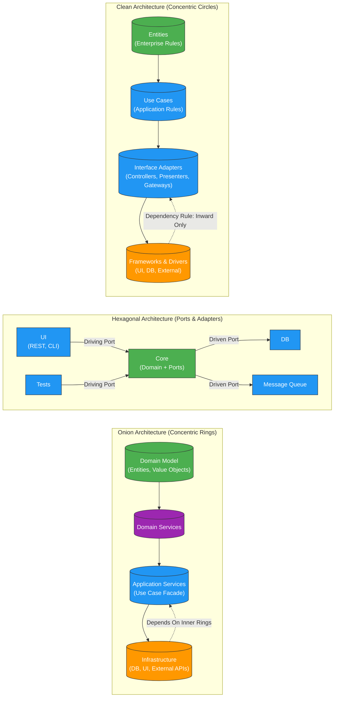

# Clean vs. Hexagonal vs. Onion Architecture

Below is a concise yet thorough comparison of **Clean Architecture**, **Hexagonal Architecture** (a.k.a. Ports & Adapters), and **Onion Architecture**.

I’ll start with a short definition of each, then a **comparison table** that highlights key attributes, and finally an **elaboration of the nuances** that set them apart in practice.

## The Architectures

| Architecture | Core Idea | Primary Proponent(s) | Key Visual Metaphor |
|--------------|-----------|----------------------|---------------------|
| **Clean** | Separate *policies* (business rules) from *details* (UI, DB, frameworks). Dependency Rule: inner layers **never** depend on outer ones. | Robert C. Martin (“Uncle Bob”) | Concentric circles (Entities → Use Cases → Interface Adapters → Frameworks & Drivers) |
| **Hexagonal** | The domain is the *core*; everything else (UI, DB, external services) plugs in via **ports** (interfaces) and **adapters** (implementations). | Alistair Cockburn | Hexagon (core) with ports on each side; adapters outside |
| **Onion** | Layers wrap around the domain like onion skins. Inner layers = pure business logic; outer layers = infrastructure, UI, tests. | Jeffrey Palermo | Onion (Domain Model → Domain Services → Application Services → Infrastructure) |

## Comparison Table

| Attribute | **Clean Architecture** | **Hexagonal Architecture** | **Onion Architecture** |
|-----------|------------------------|----------------------------|------------------------|
| **Layering model** | 4 concentric circles (Entities → Use Cases → Interface Adapters → Frameworks) | Core + Ports + Adapters (no strict count) | 4+ concentric rings (Domain Model → Domain Services → Application Services → Infrastructure) |
| **Dependency direction** | **Inward only** (outer → inner). Dependency Rule enforced by DIP. | **Inward only** via ports (core defines interfaces; adapters implement). | **Inward only** (outer rings depend on inner rings). |
| **Business rules location** | Entities (enterprise rules) + Use Cases (application rules) | Core domain (entities + domain services) | Domain Model + Domain Services |
| **Application / orchestration layer** | **Use Cases / Interactors** (explicit layer) | Not a separate layer – orchestration lives in the core or in driving adapters | **Application Services** (explicit façade) |
| **Interface definition** | Input/Output ports defined in **Interface Adapters** (controllers, presenters, gateways) | **Ports** are interfaces owned by the core (driving & driven) | Interfaces live in **inner rings**; outer rings implement them |
| **Testing emphasis** | Unit-test inner circles in isolation; outer circles are “plug-in” | Test core through ports; adapters can be mocked | Same as Clean – inner rings unit-tested, outer rings integration-tested |
| **Flexibility for UI/DB swaps** | High – swap any outer circle implementation | Very high – any adapter can be replaced without touching core | High – infrastructure ring is replaceable |
| **Explicit “infrastructure” concept** | Frameworks & Drivers (outermost) | Adapters (outside the hexagon) | Infrastructure (outermost ring) |
| **Typical package structure** | `entities/`, `usecases/`, `adapters/`, `frameworks/` | `core/` (ports + domain), `adapters/` (driving + driven) | `Domain/`, `Application/`, `Infrastructure/` |
| **Primary benefit** | Clear separation of **business policy** from **details**; strong DIP enforcement | **Portability** – core runs unchanged on any platform/adapter | **Domain-centric** design with explicit application façade |
| **Common critique** | Can feel “over-engineered” for small apps (many layers) | Naming (“hexagon”) can be confusing; less prescriptive on orchestration | Similar to Clean but with slightly different naming; sometimes seen as a variant |

## Diagrams

## Nuances & Practical Differences

### Dependency Inversion & Interface Ownership

| Architecture | Who owns the interface? | Consequence |
|--------------|------------------------|-------------|
| **Clean** | **Inner layers** (Use Cases define input/output interfaces; Interface Adapters implement them) | Guarantees the Dependency Rule; forces DIP everywhere |
| **Hexagonal** | **Core** owns **ports** (both driving & driven) | Same DIP guarantee, but ports are explicit entry/exit points |
| **Onion** | **Inner rings** (Domain/Application Services define interfaces) | Same as Clean, but Application Services act as the “API” for the domain |

Hexagonal makes the *port* concept explicit (you see `InputPort`, `OutputPort` interfaces in the core). Clean embeds the same idea inside the Interface Adapters layer, which can feel less obvious.

### Orchestration / Application Logic

* **Clean** → **Use Case / Interactor** is a *first-class* object that encapsulates a single application scenario (`PlaceOrderUseCase`). It receives input DTOs, talks to entities, and returns output DTOs.
* **Hexagonal** → Orchestration is usually done **inside the core** (domain services) **or** in a *driving adapter* (e.g., a REST controller that calls a port). There is no mandated “use-case” class.
* **Onion** → **Application Services** play the same role as Clean’s Use Cases but are often thin façades that delegate to Domain Services.

If you love **explicit use-case objects**, Clean (and Onion) give you a dedicated place. Hexagonal lets you decide where orchestration lives, which can be more flexible but also less prescriptive.

### Layer Granularity

| Clean | Hexagonal | Onion |
|-------|-----------|-------|
| 4 layers (strict) | 2 conceptual zones (core + adapters) | 4+ rings (you can add “Presentation” or “API” rings) |

Clean and Onion are *prescriptive* about the number of layers, which helps large teams stay consistent. Hexagonal is *looser*—you might end up with just `core/` and a handful of adapter packages, which can be lighter for micro-services.

### Testing Strategy

* **All three** allow the domain to be tested in isolation by mocking outer interfaces.
* **Clean** encourages **Use-Case tests** that verify the exact flow of a business scenario.
* **Hexagonal** encourages **Port-based contract tests** (e.g., `OrderServicePort` contract) and then adapter-specific integration tests.
* **Onion** mirrors Clean but often groups tests under `Application.Tests` and `Domain.Tests`.

Hexagonal’s port contract tests are excellent for **contract-driven development** (generate client stubs from ports). Clean’s use-case tests are more **behaviour-driven**.

### Visual & Naming Impact

* **Hexagonal** → The *hexagon* metaphor stresses **equivalence of all external concerns** (UI = DB = message queue). No layer is “more outer” than another.
* **Clean / Onion** → Concentric circles/rings imply a **hierarchy of importance** (domain > application > infrastructure).

When you need to communicate that *all* external systems are equally pluggable, the hexagon diagram resonates better with stakeholders.

### When to Choose Which?

| Scenario | Recommended |
|----------|-------------|
| **Large enterprise system, many teams, strict policy separation** | **Clean** (or **Onion** if you like the façade pattern) |
| **Micro-service where you want maximum portability across transports** | **Hexagonal** (ports map naturally to different protocols) |
| **Domain-Driven Design (DDD) project with explicit bounded contexts** | **Onion** (aligns with DDD layers: Entities, Value Objects, Aggregates → Domain Services → Application Services) |
| **Small CRUD app** | Any will work; **Hexagonal** often ends up lightest because you can skip the extra orchestration layer. |

## Summary

| Architecture | Core Mental Model | Strongest Suit |
|--------------|-------------------|----------------|
| **Clean** | Concentric circles + Use Cases | **Policy isolation**, explicit business scenarios |
| **Hexagonal** | Core + Ports + Adapters | **Portability**, equal treatment of all external systems |
| **Onion** | Onion rings + Application façade | **DDD alignment**, clear façade for external consumption |

All three enforce **Dependency Inversion** and **separation of concerns**. The differences are mostly **terminology, layer granularity, and where orchestration lives**. Choose based on team size, DDD adoption, and how much you value explicit use-case objects vs. flexible port contracts.
